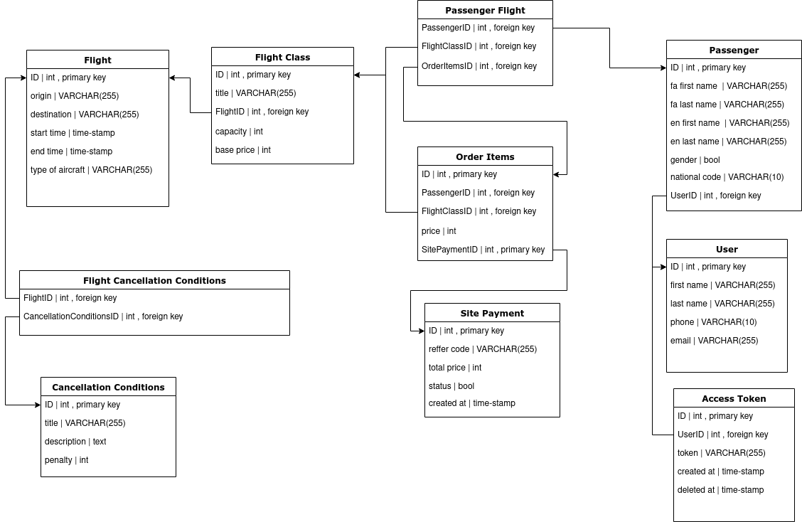

##  Alidada Features

- Using a layered architecture for higher readability and easier changes.
- Ali Dada generally includes the features of registration, login, logout, adding a new passenger, booking tickets, paying and viewing tickets.
- Using the cache layer to store the information of the planes that arrived from the MAC system.
- Ali Dada has the feature of floating price or smart price, which decides at what price to sell a ticket based on the remaining capacity of an airplane.
- Ali Dada includes a smart sorting feature that uses the capacity of the planes to decide which plane to display higher.
- Unit tests and integration tests have been written for this system.
- It has different flight classes and different prices, as well as different cancellation conditions for each of them, depending on the time, there may be different penalties for canceling the ticket.
- With the possibility of issuing tickets at the airport and assigning flight seats with limited access to the admin.

# How to run

####Run with Docker

To run the project, you only need to install Docker on your system


    docker compose up -d

An explanation of the function of each container:


The name of the container  | Function
------------- | -------------
AliDada   | Main system
MockApi  | Simulation of the central system
Qsms  | Main system
mysql1  | AliDada DB
mysql2  | MockApi DB
mysql3  | Qsms DB
redis  | Caching system

###Model diagram


We should note that Flight and FlightClass are in the MockAPI system and are shown in this section only to show the dependencies.
###Caching scenario
It is like a remember scenario, and if there is no key in the cache, it receives it from the main source and stores it to respond from the cache in case of repetition. Of course, it does not read vital information such as the capacity from the cache.
                    
```seq
application->get_flight: get flight 1
get_flight-->redis: Do we have cached? 
redis->>get_flight:no
get_flight-->mockapi: get flight 1
get_flight-->redis: cache flight 1?
application->get_flight: get flight 1 again
get_flight-->redis: Do we have cached? 
redis->>get_flight:yes
get_flight->redis: get flight 1 from redis

```

###End
